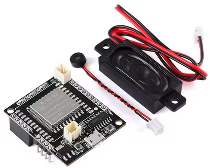

# Targeted Individual Simulator (v0.2.2)

## ⚠️ Disclaimer

This project is an **interactive simulator** inspired by real testimonies from individuals who identify as *Targeted Individuals*.  
It is designed **not** to assert the objective truth of these claims, but to **model the experience** as reported — for research, education, and system design testing.

The simulator explores how a **hypothetical bi-directional BCI** could influence perception, behavior, and cognition in real-time, using known computing paradigms such as forward/backward chaining and EEG signal processing.

If you're a computer scientist, or neuroscientist, this project may offer a testbed to:
- model perception-based interactions,
- simulate psychological stress scenarios,
- explore the ethical boundaries of emerging BCI technologies.

## 🚀 Goal

The goal is to simulate an environment where a person *feels* persistently surveilled or manipulated,  
similar to the experiences reported by many self-identified Targeted Individuals — but in a **safe, local, and removable way**.

This does **not** claim that such technology currently exists in this form or is deployed by governments or other actors.  
Rather, it is an experimental tool to promote dialogue, system awareness, and technical exploration of these ideas.

## Conceptual design
The system is an Intelligent (Autonomous) Agent https://en.wikipedia.org/wiki/Intelligent_agent
It can be modeled conceptually as the sense, reason and act framework.

# Physical design

$5 electronics can implement the sense, reason and act framework. It is an offline voice recognition agent that reasons and acts (incl. by responding with voice): 
https://www.youtube.com/watch?v=dAqX4CmozfM&ab_channel=techiesms

The electronics can be purchased at https://www.aliexpress.com/item/1005008356177308.html 

It is programmable, so you can add rules to make it pick up particular things you say and respond to them. Programming can leverage forward chaining and backward chaining to infer situations that can be automatically responded, or achieve pre-defined goals.

The only missing part is a BCI that can sense the human inner voice and decode it into audible speech (Thought to speech) and its opposite, a BCI that can stimulate a human brain to produce a human inner voice with a reply from the electronics (Speech to thought).

Until thought to speech and speech to tought are researched and developed, the simulator can be executed by speaking aloud while you're thinking. The electronics will pick it up and reply based on rules. Sample rules will be based on real-world data collected from people who identify themselves as targeted. 

# Extension for a more genuine sensing experience
The simulator can work without having to speak loud while you're thinking. This can be achieved using Thought2Text https://github.com/abhijitmishra/Thought2Text It is currently an EEG-based solution. It is not ready for production use. An EEG device with 16 channels costs around $1000.
One possible breakthrough design that realizes Thought to text via fMRI: https://www.nature.com/articles/s41593-023-01304-9 

# Extension for a more genuine stimulation experience
The simulator can work without anyone else hearing what it tells you. This can be achieved by replacing the speaker that comes in the $5 kit with Audio Splotlight, however the cheapest unit Holosonics AS-168iX costs $1,299 https://www.touchwindow.com/p/AS-168iX.html

# Extension to simulate an automated agent-victim interaction (two modules talking to each other)
The simulator is currently conceptualized to simulate a victim. It is however possible to buy the same $5 electronics twice, and make the modules talk to each other to simulate a whole interaction for an objective observer.

# Extension to simulate an interactive agent-victim interaction mediated by 2 people
With two $5 modules, it is possible to develop one module as an agent who can create custom CEP rules, enable/disable them, and enable/disable harassment of a victim that way. For example, when the agent says a command "turn the harassment on/off" the victim module should start/stop responding to what the victim thinks. These two modules can be tested with two people who will be at home and use the Internet to connect their speaker/mic from the agent module to the victim module.

This model lets an agent do espionage by listening what the victim is thinking, coming up with extremely arrogant putdowns, creating rules, and then turning them on all at the same time. From that time onward, the victim will hear those putdowns played automatically based on rules. Responses will be played based on what the victim is thinking. Compared to the real phenomenon, this will lack adaptivity, so putdowns that stopped having a negative impact on the victim won't get automatically replaced with new ones. If the victim would wear EEG that could measure negative effect (stress, etc.) caused by the putdowns, there could be an automated adaptive loop to ditch pre-recorded putdowns when their impact becomes low, in order to keep playing high-impact putdowns to the victim.
